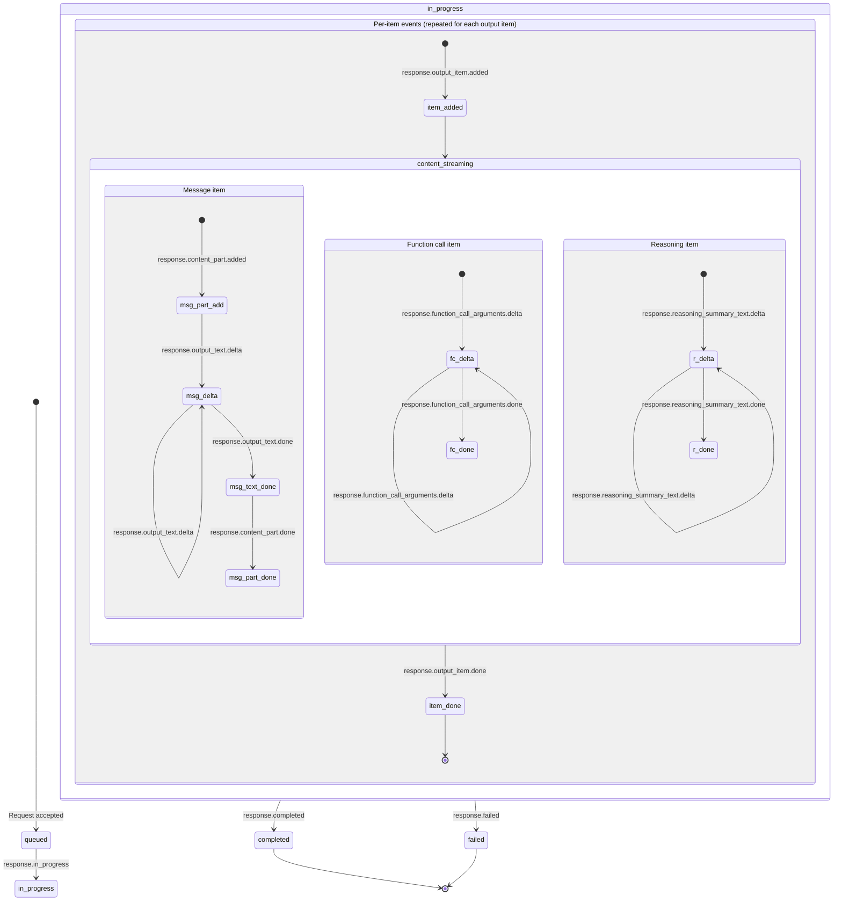
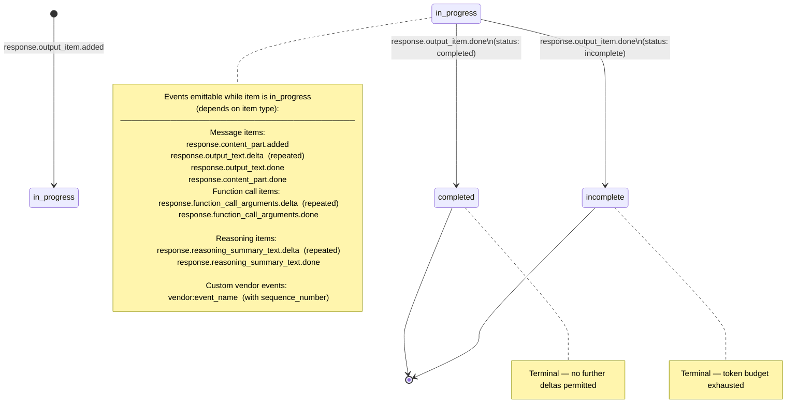
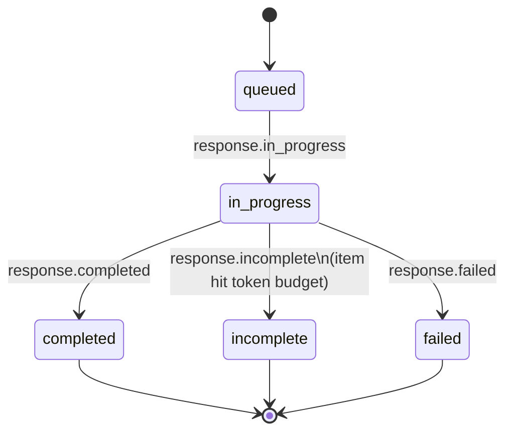

# State Machines and Streaming Events Reference

Complete state machine specifications and streaming event catalog for the Open Responses standard.

## State Machines

Every item and every response follows a finite state machine. Understanding these transitions is essential for both server implementors and client consumers.

### Response Lifecycle — Full State Machine with Events



### Item State Machine



### Response State Machine (Simple)



| State | Description | Transitions To |
|-------|-------------|---------------|
| `queued` | Request accepted, waiting for model availability | `in_progress` |
| `in_progress` | Model is actively generating output items | `completed`, `incomplete`, `failed` |
| `completed` | All output items finalized successfully | *(terminal)* |
| `incomplete` | An item exhausted its token budget; response ends early | *(terminal)* |
| `failed` | An error occurred during generation | *(terminal)* |

> **Constraint:** If any item ends in `incomplete` status, the containing response MUST also be `incomplete`.

### Events Emitted Per Response Transition

| Transition | Event Emitted | When |
|-----------|---------------|------|
| `queued` -> `in_progress` | `response.in_progress` | Model begins processing |
| `in_progress` -> `completed` | `response.completed` | All items done, response finalized |
| `in_progress` -> `incomplete` | `response.incomplete` | Item exhausted token budget |
| `in_progress` -> `failed` | `response.failed` | Error during generation |

### What Can Be Emitted When — Complete Matrix

All delta and item events carry these fields for stream reconstruction:
- `sequence_number` — monotonically increasing integer for ordering and gap detection
- `output_index` — position in the response output array
- `content_index` — position within a content part (for content-level events)
- `item_id` — references the affected item

| Response State | Item State | Valid Events |
|---------------|-----------|--------------|
| `queued` | *(no items yet)* | *(none)* |
| `in_progress` | *(no item yet)* | `response.output_item.added` |
| `in_progress` | `in_progress` (message) | `response.content_part.added`, `response.output_text.delta`, `response.output_text.done`, `response.content_part.done`, `vendor:*` |
| `in_progress` | `in_progress` (function_call) | `response.function_call_arguments.delta`, `response.function_call_arguments.done`, `vendor:*` |
| `in_progress` | `in_progress` (reasoning) | `response.reasoning_summary_text.delta`, `response.reasoning_summary_text.done`, `vendor:*` |
| `in_progress` | `completed` / `incomplete` | `response.output_item.added` (next item), or transition to `completed`/`incomplete`/`failed` |
| `completed` | *(all items terminal)* | *(none — only `[DONE]` marker)* |
| `incomplete` | *(at least one item incomplete)* | *(none — only `[DONE]` marker)* |
| `failed` | *(items may be incomplete)* | *(none — only `[DONE]` marker)* |

### State Machine Example: Simple Text Response

The response starts `queued`, transitions to `in_progress` (emitting `response.in_progress`), creates a message item in `in_progress` state, streams text deltas, marks the item `completed`, then the response transitions to `completed`:

```json
// 1. Response transitions queued -> in_progress
{"type": "response.in_progress", "sequence_number": 0, "response": {"id": "resp_001", "status": "in_progress", "output": []}}

// 2. New item created in in_progress state
{"type": "response.output_item.added", "sequence_number": 1, "output_index": 0, "item": {"id": "item_001", "type": "message", "status": "in_progress", "content": []}}

// 3. Text deltas emitted while item is in_progress
{"type": "response.output_text.delta", "sequence_number": 2, "item_id": "item_001", "output_index": 0, "content_index": 0, "delta": "The capital"}
{"type": "response.output_text.delta", "sequence_number": 3, "item_id": "item_001", "output_index": 0, "content_index": 0, "delta": " of France"}
{"type": "response.output_text.delta", "sequence_number": 4, "item_id": "item_001", "output_index": 0, "content_index": 0, "delta": " is Paris."}

// 4. Item transitions in_progress -> completed
{"type": "response.output_item.done", "sequence_number": 5, "output_index": 0, "item": {"id": "item_001", "type": "message", "status": "completed", "content": [{"type": "output_text", "text": "The capital of France is Paris."}]}}

// 5. Response transitions in_progress -> completed
{"type": "response.completed", "sequence_number": 6, "response": {"id": "resp_001", "status": "completed", "output": [...]}}
```

### State Machine Example: Tool Call Response

When the model decides to call a tool, the response emits a `function_call` item instead of (or in addition to) a message item. The response completes with the function_call item, and the developer must send a follow-up request with the tool result:

```json
// 1. Response starts
{"type": "response.in_progress", "sequence_number": 0, "response": {"id": "resp_002", "status": "in_progress"}}

// 2. Function call item created
{"type": "response.output_item.added", "sequence_number": 1, "output_index": 0, "item": {"id": "item_010", "type": "function_call", "name": "get_weather", "call_id": "call_xyz", "status": "in_progress"}}

// 3. Function arguments streamed
{"type": "response.function_call_arguments.delta", "sequence_number": 2, "item_id": "item_010", "output_index": 0, "delta": "{\"location\":\"Par"}
{"type": "response.function_call_arguments.delta", "sequence_number": 3, "item_id": "item_010", "output_index": 0, "delta": "is\"}"}

// 4. Function call item completed
{"type": "response.output_item.done", "sequence_number": 4, "output_index": 0, "item": {"id": "item_010", "type": "function_call", "name": "get_weather", "call_id": "call_xyz", "arguments": "{\"location\":\"Paris\"}", "status": "completed"}}

// 5. Response completed (with pending tool call)
{"type": "response.completed", "sequence_number": 5, "response": {"id": "resp_002", "status": "completed"}}
```

### State Machine Example: Failed Response

```json
// 1. Response starts
{"type": "response.in_progress", "sequence_number": 0, "response": {"id": "resp_003", "status": "in_progress"}}

// 2. Error occurs — response transitions to failed
{"type": "response.failed", "sequence_number": 1, "response": {"id": "resp_003", "status": "failed", "error": {"type": "model_error", "code": "context_length_exceeded", "message": "Input exceeds maximum context length."}}}
```

---

## Streaming Events

### SSE Format

Each event is two lines followed by a blank line:

```
event: response.output_text.delta
data: {"type":"response.output_text.delta","sequence_number":3,"item_id":"item_001","output_index":0,"content_index":0,"delta":"Hello"}

```

The `event` header must match the `type` field in the JSON body. All events carry `sequence_number` for ordering; item/content events also carry `output_index`, `content_index`, and `item_id` for stream reconstruction.

### Delta Events (Incremental Content)

These events carry content fragments as they are generated:

| Event | Purpose | Key Payload Fields |
|-------|---------|-------------------|
| `response.output_item.added` | New item started | `sequence_number`, `output_index`, `item` (full item, status: in_progress) |
| `response.content_part.added` | Content part opened | `sequence_number`, `item_id`, `output_index`, `content_index`, `part` |
| `response.output_text.delta` | Text token | `sequence_number`, `item_id`, `output_index`, `content_index`, `delta` |
| `response.output_text.done` | Text complete for part | `sequence_number`, `item_id`, `output_index`, `content_index`, `text` |
| `response.function_call_arguments.delta` | Tool argument fragment | `sequence_number`, `item_id`, `output_index`, `delta` |
| `response.function_call_arguments.done` | Tool arguments complete | `sequence_number`, `item_id`, `output_index`, `arguments` |
| `response.reasoning_summary_text.delta` | Reasoning fragment | `sequence_number`, `item_id`, `output_index`, `content_index`, `delta` |
| `response.reasoning_summary_text.done` | Reasoning complete | `sequence_number`, `item_id`, `output_index`, `content_index`, `text` |
| `response.content_part.done` | Content part closed | `sequence_number`, `item_id`, `output_index`, `content_index`, `part` |
| `response.output_item.done` | Item finalized | `sequence_number`, `output_index`, `item` (full item, status: completed) |

### Lifecycle Events (State Transitions)

These events signal response-level state machine transitions:

| Event | Purpose | Response Status |
|-------|---------|----------------|
| `response.in_progress` | Generation started | `in_progress` |
| `response.completed` | All output finalized | `completed` |
| `response.incomplete` | Item exhausted token budget | `incomplete` |
| `response.failed` | Error occurred | `failed` |

### Complete Streaming Sequence: Text Response

```
event: response.in_progress
data: {"type":"response.in_progress","sequence_number":0,"response":{"id":"resp_001","status":"in_progress","output":[]}}

event: response.output_item.added
data: {"type":"response.output_item.added","sequence_number":1,"output_index":0,"item":{"id":"item_001","type":"message","role":"assistant","status":"in_progress","content":[]}}

event: response.content_part.added
data: {"type":"response.content_part.added","sequence_number":2,"item_id":"item_001","output_index":0,"content_index":0,"part":{"type":"output_text","text":""}}

event: response.output_text.delta
data: {"type":"response.output_text.delta","sequence_number":3,"item_id":"item_001","output_index":0,"content_index":0,"delta":"The capital"}

event: response.output_text.delta
data: {"type":"response.output_text.delta","sequence_number":4,"item_id":"item_001","output_index":0,"content_index":0,"delta":" of France is Paris."}

event: response.output_text.done
data: {"type":"response.output_text.done","sequence_number":5,"item_id":"item_001","output_index":0,"content_index":0,"text":"The capital of France is Paris."}

event: response.content_part.done
data: {"type":"response.content_part.done","sequence_number":6,"item_id":"item_001","output_index":0,"content_index":0,"part":{"type":"output_text","text":"The capital of France is Paris."}}

event: response.output_item.done
data: {"type":"response.output_item.done","sequence_number":7,"output_index":0,"item":{"id":"item_001","type":"message","role":"assistant","status":"completed","content":[{"type":"output_text","text":"The capital of France is Paris."}]}}

event: response.completed
data: {"type":"response.completed","sequence_number":8,"response":{"id":"resp_001","status":"completed","output":[...],"usage":{"input_tokens":12,"output_tokens":9}}}

data: [DONE]
```

### Complete Streaming Sequence: Tool Use

```
event: response.in_progress
data: {"type":"response.in_progress","sequence_number":0,"response":{"id":"resp_002","status":"in_progress"}}

event: response.output_item.added
data: {"type":"response.output_item.added","sequence_number":1,"output_index":0,"item":{"id":"item_010","type":"function_call","name":"get_weather","call_id":"call_xyz","status":"in_progress"}}

event: response.function_call_arguments.delta
data: {"type":"response.function_call_arguments.delta","sequence_number":2,"item_id":"item_010","output_index":0,"delta":"{\"location\":"}

event: response.function_call_arguments.delta
data: {"type":"response.function_call_arguments.delta","sequence_number":3,"item_id":"item_010","output_index":0,"delta":"\"Paris\",\"units\":\"celsius\"}"}

event: response.function_call_arguments.done
data: {"type":"response.function_call_arguments.done","sequence_number":4,"item_id":"item_010","output_index":0,"arguments":"{\"location\":\"Paris\",\"units\":\"celsius\"}"}

event: response.output_item.done
data: {"type":"response.output_item.done","sequence_number":5,"output_index":0,"item":{"id":"item_010","type":"function_call","name":"get_weather","call_id":"call_xyz","arguments":"{\"location\":\"Paris\",\"units\":\"celsius\"}","status":"completed"}}

event: response.completed
data: {"type":"response.completed","sequence_number":6,"response":{"id":"resp_002","status":"completed"}}

data: [DONE]
```

### Custom Streaming Events

Providers can emit custom events using vendor-prefixed names:

```
event: acme:trace_event
data: {"type":"acme:trace_event","sequence_number":1,"trace_id":"t_abc","span":"model.inference","duration_ms":142}
```

**Required fields on custom events:**

| Field | Type | Description |
|-------|------|-------------|
| `type` | string | Event schema identifier with vendor prefix |
| `sequence_number` | integer | Monotonically increasing for ordering |

**Constraints:** Custom events must NOT alter core response semantics, token ordering, or item lifecycle. Clients must silently ignore unknown event types for forward compatibility.
