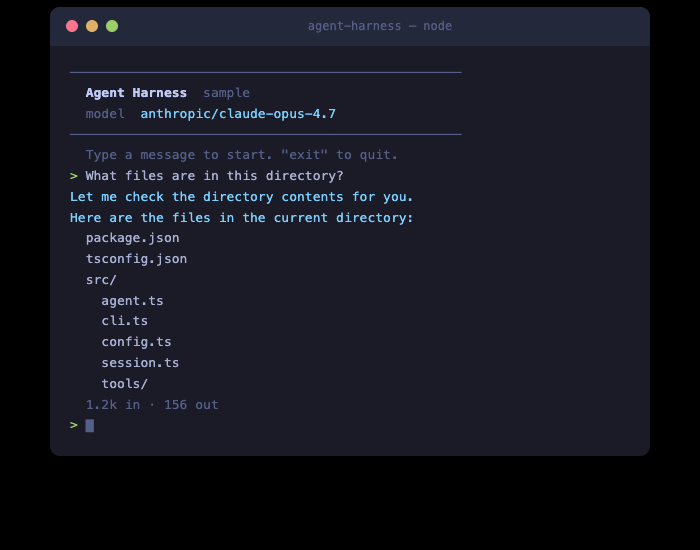

# Agent Harness

A skill for AI coding agents (Claude Code, Cursor, etc.) that generates a working agent harness in TypeScript, targeting [OpenRouter](https://openrouter.ai). Give it to your coding agent, tell it what kind of agent you want to build, and it produces a runnable project with tools, configuration, and an entry point.

The generated harness draws from three production agent systems:

- [pi-mono/coding-agent](https://github.com/badlogic/pi-mono/tree/main/packages/coding-agent) — three-layer architecture, JSONL sessions, pluggable tool operations
- Claude Code — tool metadata, permission model, system prompt composition
- [Codex CLI](https://github.com/openai/codex) — layered config, approval flow, structured logging

## When to use this

Building your own agent harness makes sense when:

- **You need custom tools** — your agent interacts with your own APIs, databases, or domain-specific systems that generic agents can't reach
- **You want control over the loop** — you need custom stop conditions, approval flows, cost limits, or model selection logic that hosted agents don't expose
- **You're shipping a product** — the agent is part of your application, not a developer tool, and you need to own the entry point (CLI, API server, embedded)
- **You want to learn** — understanding how agents work at the tool-execution level makes you better at using and debugging them

You probably *don't* need this if you're just using Claude Code or Cursor as-is — those are already production agent harnesses. This is for when you need to build your own.

## What you can customize

The skill presents an interactive checklist when invoked. You pick what you need:

### Server tools (executed by OpenRouter, zero client code)

| Tool | Default | What it does |
|------|---------|-------------|
| Web Search | on | Real-time web search via `openrouter:web_search` |
| Datetime | on | Current date/time via `openrouter:datetime` |
| Image Generation | off | Generate images via `openrouter:image_generation` |

### User-defined tools (your code, executed locally)

| Tool | Default | What it does |
|------|---------|-------------|
| File Read | on | Read files with offset/limit, detect images |
| File Write | on | Create/overwrite files, auto-create directories |
| File Edit | on | Search-and-replace with diff output |
| Glob/Find | on | Find files by pattern |
| Grep/Search | on | Search file contents by regex |
| Directory List | on | List directory entries |
| Shell/Bash | on | Execute commands with timeout |
| JS REPL | off | Persistent Node.js environment |
| Sub-agent Spawn | off | Delegate tasks to child agents |
| Plan/Todo | off | Track multi-step task progress |
| Request User Input | off | Ask structured questions |
| Web Fetch | off | Fetch and extract text from URLs |
| View Image | off | Read local images as base64 |
| Custom Tool Template | on | Empty skeleton for your domain |

### Harness modules (architectural components)

| Module | Default | What it does |
|--------|---------|-------------|
| Session Persistence | on | JSONL append-only conversation log |
| Context Compaction | off | Summarize old messages when context gets long |
| System Prompt Composition | off | Build instructions from static + dynamic context files |
| Tool Permissions | off | Gate dangerous tools behind user approval |
| Structured Logging | off | Emit events for tool calls, API requests, errors |

## What `@openrouter/agent` handles

The generated harness doesn't reimplement the agent loop — [`@openrouter/agent`](https://www.npmjs.com/package/@openrouter/agent) handles all of that:

| Concern | How `@openrouter/agent` handles it |
|---------|-------------------------------------|
| **Model calls** | `client.callModel()` — one call, any model on OpenRouter |
| **Tool execution** | Automatic — define tools with `tool()` and Zod schemas, the SDK validates input and calls your `execute` function |
| **Multi-turn** | Automatic — the SDK loops (call model → execute tools → call model) until a stop condition fires |
| **Stop conditions** | `stepCountIs(n)`, `maxCost(amount)`, `hasToolCall(name)`, or custom functions |
| **Streaming** | `result.getTextStream()` for text deltas, `result.getToolCallsStream()` for tool calls |
| **Cost tracking** | `result.getResponse().usage` with input/output token counts |
| **Dynamic parameters** | Model, temperature, and other params can be functions of conversation context |
| **Shared context** | Type-safe shared state across tools via `sharedContextSchema` |
| **Turn lifecycle** | `onTurnStart` / `onTurnEnd` callbacks for logging, compaction triggers, etc. |

The harness you build provides everything *around* that loop: configuration, tool definitions, session persistence, the entry point (CLI or API server), and any modules you select from the checklist.

## Generated project structure

With all defaults selected, the harness produces:

```
my-agent/
  package.json              @openrouter/agent, zod, tsx
  tsconfig.json             ES2022, Node16, strict
  .env.example              OPENROUTER_API_KEY=
  src/
    config.ts               Layered config (defaults -> file -> env)
    agent.ts                Core runner with retry
    cli.ts                  Interactive REPL
    session.ts              JSONL conversation persistence
    tools/
      index.ts              Tool registry + server tools
      file-read.ts          Read files
      file-write.ts         Write files
      file-edit.ts          Search-and-replace with diff
      glob.ts               Find files by pattern
      grep.ts               Search content by regex
      list-dir.ts           List directories
      shell.ts              Execute commands
```

## Sample

A complete working harness with all defaults is in [`sample/`](sample/). It includes a clean terminal UI with streaming output, token counts, and session persistence.



To try it:

```bash
cd sample
npm install
OPENROUTER_API_KEY=your-key-here npm start
```

## Installation

This is a skill for the [OpenRouter skills plugin](https://github.com/OpenRouterTeam/skills). Install the plugin in Claude Code:

```
/plugin marketplace add OpenRouterTeam/skills
/plugin install openrouter@openrouter
```

Then ask your agent to build an agent harness and it will use this skill automatically.
